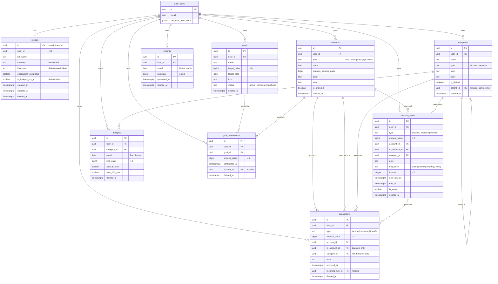

# FinPilot database

Postgres on Supabase, replicated to each device by PowerSync. Every table is
owned by a user, protected by Row Level Security, and soft-deleted only.

## Principles

| Rule                      | How it is enforced                                                                      |
| ------------------------- | --------------------------------------------------------------------------------------- |
| Client-generated UUID PKs | `id uuid primary key`; the `gen_random_uuid()` default is only a server-side safety net |
| Money is integer paise    | every amount column is `bigint`, with `CHECK (… > 0)` where a sign makes no sense       |
| Ownership on every row    | `user_id uuid not null references auth.users(id) on delete cascade`                     |
| Soft delete only          | `deleted_at timestamptz`; no DELETE policy and `REVOKE DELETE` from client roles        |
| Honest timestamps         | `created_at`/`updated_at` defaults plus a `set_updated_at()` BEFORE UPDATE trigger      |
| No cross-user references  | composite FKs on `(child_column, user_id) → parent (id, user_id)`                       |
| Enumerations              | `TEXT` + `CHECK`, not Postgres enums — PowerSync mirrors into SQLite, which has none    |

## ER diagram



## Tables

### profiles

One row per auth user, created by the `on_auth_user_created` trigger. `id` is
the auth user id; `user_id` duplicates it so that every table in the schema —
and therefore every RLS policy and PowerSync sync rule — keys off `user_id`
uniformly. A `CHECK (user_id = id)` keeps the two honest.

Defaults: `currency = 'INR'`, `timezone = 'Asia/Kolkata'`,
`onboarding_completed = false`, `ai_insights_opt_in = false` (AI features are
opt-in, never on by default).

### accounts

`type` is one of `cash`, `bank`, `card`, `upi_wallet`. `opening_balance_paise`
may be negative — a credit card starts in the red. Archiving is a flag, not a
delete, so historical transactions keep their account.

### categories

Self-referencing via `parent_id` for sub-categories, constrained to the same
owner and to not be its own parent. `is_default` marks the seeded set.

### transactions

`amount_paise` is always **positive**; direction comes from `type`. Two CHECK
constraints enforce the shape:

- `transfer` → `to_account_id` present and different from `account_id`,
  `category_id` null.
- `income` / `expense` → `to_account_id` null, `category_id` present.

### recurring_rules

The transaction template (`type`, `amount_paise`, accounts, category, note)
plus the schedule (`frequency`, `interval`, `next_run_at`, `end_at`,
`is_active`). Generated transactions point back via
`transactions.recurring_rule_id`.

### budgets

One live budget per `(user_id, category_id, month)` — enforced by a partial
unique index that ignores soft-deleted rows. `month` must be the first of the
month. `alert_80_sent` / `alert_100_sent` stop a threshold alert firing twice.

### goals and goal_contributions

A goal has a target and a status; contributions are individual payments toward
it, optionally attributed to the account they came from.

### insights

One AI/summary document per `(user_id, month)`, stored as a JSON object.
`generated_at` records when it was produced.

## Row Level Security

RLS is **enabled and forced** on all nine tables. Each has exactly three
policies for the `authenticated` role:

```sql
select  using (user_id = (select auth.uid()))
insert  with check (user_id = (select auth.uid()))
update  using (user_id = (select auth.uid())) with check (user_id = (select auth.uid()))
```

Notes:

- **No DELETE policy, and `REVOKE DELETE`** from `anon` and `authenticated`.
  Clients delete by setting `deleted_at`; the soft-deleted row stays readable
  by its owner so PowerSync can replicate the deletion to their other devices.
- `profiles` additionally has **no INSERT** for clients — the row comes from
  the auth trigger.
- `anon` has no privileges on any table, so an unauthenticated request is
  refused before RLS is even consulted.
- `FORCE ROW LEVEL SECURITY` means even the table owner is subject to the
  policies, so a mistake in a `SECURITY DEFINER` function cannot quietly read
  across users.
- Cross-user references are impossible by construction: every child FK is
  composite, `(account_id, user_id) → accounts (id, user_id)`, so a row can
  only point at a parent owned by the same user.

## New user trigger

`on_auth_user_created` fires `public.handle_new_user()` after an insert into
`auth.users`. It creates the profile (taking `full_name` from the signup
metadata) and calls `public.seed_default_categories()`, which inserts 17
categories and is idempotent:

**Expense** — Food, Groceries, Rent, Transport, Fuel, Shopping,
Bills & Utilities, EMI, Health, Education, Entertainment, Travel, Other
**Income** — Salary, Freelance, Interest, Refund

Both functions are `SECURITY DEFINER` with a pinned `search_path`, and
`EXECUTE` is revoked from client roles.

## PowerSync

The `powersync` publication lists the nine synced tables explicitly, so adding
a table to replication is a deliberate act. Replica identity is left at
`DEFAULT` (the primary key), which is sufficient because every table has a UUID
PK and rows are never hard-deleted.

Two things must be done **on the Supabase project**, outside migrations:

1. `wal_level = logical` — already the Supabase default.
2. A replication role, because its password must not live in version control:

   ```sql
   create role powersync_role with replication login password '<strong password>';
   grant select on all tables in schema public to powersync_role;
   alter default privileges in schema public grant select on tables to powersync_role;
   ```

Then point the PowerSync instance at the database with that role and the
`powersync` publication.

## Working locally

The canonical workflow needs Docker:

```bash
npm run db:start     # supabase start
npm run db:reset     # applies supabase/migrations to the local stack
supabase test db     # runs supabase/tests/*.test.sql with pgTAP
npm run db:types     # regenerates src/db/database.types.ts
```

Without Docker, the same migrations and the same pgTAP files run against a
plain local Postgres:

```bash
# As a Postgres superuser - the script creates roles and a database:
PSQL_SUPERUSER=postgres scripts/db-test.sh    # creates finpilot_test, applies, tests
node scripts/generate-database-types.mjs "postgresql://postgres@localhost:5432/finpilot_test"
```

`scripts/db-test.sh` first applies
`supabase/tests/helpers/local_supabase_shim.sql`, which recreates the parts of
a Supabase project that live outside our migrations: the `auth` schema,
`auth.users`, the JWT-backed `auth.uid()` and the `anon` / `authenticated` /
`service_role` roles. That shim is test-only and never runs against a real
project.

## Tests

| File                                | Covers                                                                                                                                                                                     |
| ----------------------------------- | ------------------------------------------------------------------------------------------------------------------------------------------------------------------------------------------ |
| `supabase/tests/01_rls.test.sql`    | 54 assertions: user A cannot read, update, re-own or reference user B's rows; no hard deletes; anon is locked out; soft deletes work and stay visible to their owner                       |
| `supabase/tests/02_schema.test.sql` | 57 assertions: the new-user trigger, the seeded category set, amount and transfer CHECKs, enumerated values, month-keyed uniqueness, the `updated_at` trigger, indexes and the publication |

| `supabase/tests/03_conflict_resolution.test.sql` | last write wins by `updated_at`: stale writes skipped, clock skew clamped, stale deletes ignored |
| `supabase/tests/04_ai_insights.test.sql` | the AI request log is server-side only: RLS on with no policies, no client privileges, not replicated |
| `supabase/tests/05_ai_insight_aggregates.test.sql` | the AI aggregation returns the right figures and **no** notes, account names, transfers or other users' rows; a client cannot call it |
| `supabase/tests/06_account_deletion.test.sql` | a client still cannot hard-delete; the Edge Function's delete order satisfies every foreign key; the other user is untouched; the auth-user cascade catches the rest |

## Server-side-only objects

Two objects exist for the AI insights feature and are deliberately outside the
sync path (see [AI_INSIGHTS.md](./AI_INSIGHTS.md)):

- **`ai_insight_requests`** — one row per `generate-insights` call: the rate
  limit and the audit trail. Not in the `powersync` publication, RLS enabled
  with **no policies**, every privilege revoked from `anon` and
  `authenticated`. Only the service role touches it.
- **`ai_insight_aggregates(user_id, month)`** — a `SECURITY DEFINER` function
  with a pinned `search_path`, `EXECUTE` granted only to `service_role`. It is
  the single statement the Edge Function runs against a user's data, so what
  the feature may read is visible in the schema rather than spread through a
  handler.

## Types

`src/db/database.types.ts` is generated from the live schema — do not edit it.
Because enumerations are `TEXT` + `CHECK`, the generated types say `string`;
narrow through the unions and guards in `src/db/enums.ts`
(`AccountType`, `TransactionType`, `isGoalStatus`, …), which are asserted
against the migration's CHECK lists in `src/db/__tests__/enums.test.ts`.
